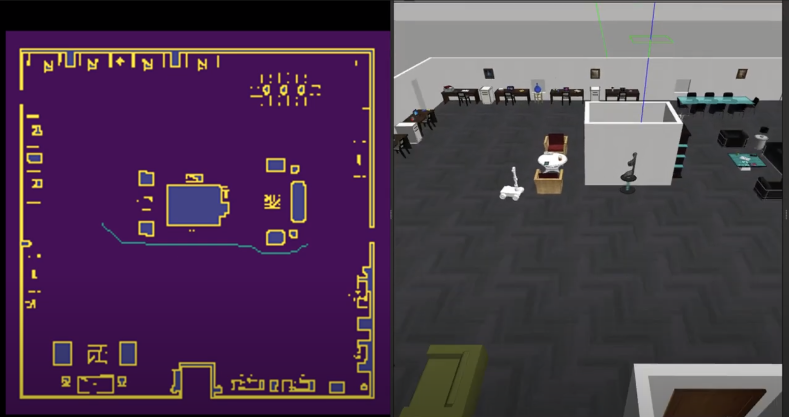

# Motion Planning-For-Mobile-Manipulator
16782- Planning and Decision Making project


## Overview

This repository contains implementation of combined planner for mobile manipulator in ROS and gazebo environment. The aim of the project is to implement constrained 3D A* algorithm for navigation and variations of RRT for manipulation. Since the mobile manipulator cannot turn in place, we assume only 3 motion primitives and plan the navigation accordingly.

The complete theory and implementation report can be found here: 16782__Planning_and_Decision_making_Project_Report.pdf

The code assumes that ROS (Melodic/Neotic), gazebo as well as other basic dependencies are already installed.

## Installation and Implementation

**Step 1: Clone this repository.**

```shell
git clone https://github.com/tan-may16/Planning-For-Mobile-Manipulator.git
```

**Step 2: Install the project specific Dependencies (Replace distro with your ROS version name)**

```shell
sudo apt-get install libmove-base-msgs-dev
pip install rospkg
sudo apt-get install ros*controller*
sudo apt-get install ros-distro*joint-trajectory-controller*
sudo apt-get install mate-terminal
sudo apt-get install xdotool
```

**Step 3: Get the Gazebo Worlds.**

The repository uses the pre-developed gazebo worlds. These worlds can be downloaded using the following instructions.

1. Delete the existing gazebo_models_worlds_collection folder.

2. Download all the models and worlds from the gazebo world collections.

```shell
git clone https://github.com/leonhartyao/gazebo_models_worlds_collection.git
```

3. Follow the instructions provided in the gazebo_models_worlds_collection repository.In particular, do the following:

Open the bash file and export the path.

```shell
gedit ~/.bashrc
export GAZEBO_MODEL_PATH=$GAZEBO_MODEL_PATH:<path to this repo>/models
export PYTHONPATH=$PYTHONPATH:/usr/lib/python3.8/dist-packages
```
Change the Python version in the last line if different. Save the bash file and close it. 


4. Sample edited world files for office_smalll and office_env_large have been provided in the sample_worlds folder. To use the sample world, replace both files from sample_world folder with the corresponding worlds files from gazebo_models_worlds_collection/worlds/. 

Note: If you are using small office, replace the office_map.txt from Navigation/small_world with Navigation/code/office_map.txt. The current map loaded is the map for large office.


5. Make sure the world path is correct in the following mobile manipulator launch file: src/mobile_manipulator/launch/mobile_manipulator_gazebo.launch. The path of the world is on line 9. Even if you are using sample world, you will have to edit this path.

Note: For using other worlds, you will have to edit the world files, and also create a custom 2D map text for the world for the navigation. Details of how to create that are given the report attached. Replace that newly created map with the office_map.txt in Navigation'code folder.

**Step 4: Build ROS packages.**

Copy the src folder from the repository into your catkin workspace src folder (catkin_ws/src).

Build the packages
```shell
cd ~/catkin_ws
catkin_make
source ~/catkin_ws/devel/setup.bash
```

**Step 5: Run the combinedPlanner.sh file with appropriate required arguments and enjoy!**
```shell
cd Planning-For-Mobile-Manipulator
./combinedPlanner.sh 2 3 180 2 -3 0 3.14 1.047 0.3 1.57 0
```
## Command Line Arguments

All the command line arguments are mandatory arguments.The coordinate system starts at the centre of the map. All the distances are relative to this coordinate system.

First 3 arguments represent initial position of mobile manipulator(x_init, y_init, theta_init). 

Similarly,next 3 arguments represent final position of mobile manipulator (x_final, y_final, theta_final)

 Note: The above thetas are in degress.
 
 Last 5 arguments represent the final/desired configuration of manipulator when it reaches the destination. (In radians)


## Sample Output
* **Gazebo world used in the example**


The gazebo world was converted into pgm file using the following 2D gazebo plugin - https://github.com/marinaKollmitz/gazebo_ros_2Dmap_plugin


Screenshot of Actual Demo. Complete Video-demo link: https://tinyurl.com/mobileManipulator 

 Sample result top view for small office world: 
 


## References

[1] How to Build a Simulated Mobile Robot Base Using ROS 

https://automaticaddison.com/how-to-build-a-simulated-mobile-robot-base-using-ros/


[2] Gazebo models and world collection 

https://github.com/chaolmu/gazebo_models_worlds_collection

[3] gazebo 2D plugin: https://github.com/marinaKollmitz/gazebo_ros_2Dmap_plugin

[4] Generate Octomap from Gazebo world

https://github.com/heronsystems/OpenMACE/wiki/Generate-Octomap-from-Gazebo-world

[5] Creating MoveIt Plugins: https://github.com/ros-planning/moveit_tutorials/blob/master/doc/creating_moveit_plugins/plugin_tutorial.rst

[6] Developing a Planning Request Adapter: http://wiki.ros.org/industrial_trajectory_filters/Tutorials/PlanningRequestAdapterTutorial

[7] Collision checking in Robot arm using MoveIt:

https://subscription.packtpub.com/book/hardware-&-creative/9781783551798/10/ch10lvl1sec74/collision-checking-in-robot-arm-using-moveit
 
